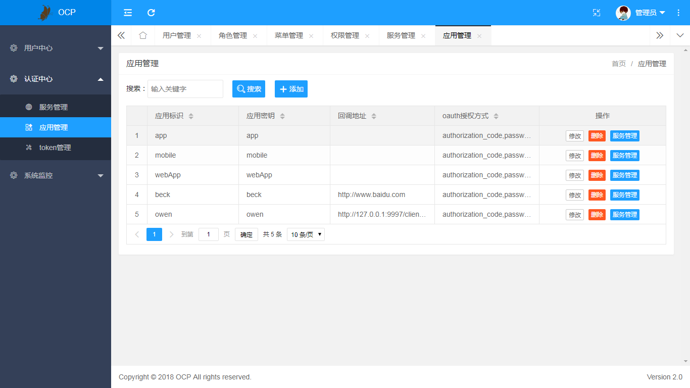

# central-platform

<p align="center">
 
  
  

</p>

### 欢迎进群（群内领资料）

`一键加群`

<a target="_blank" href="https://jq.qq.com/?_wv=1027&k=5JSjd5D"></a>


#### 项目介绍
从无到有搭建企业级微服务框架，为企业级项目提供一套完善的，运行稳定，多种分布式问题的解决方案;

central-platform简称CP，基于Spring Cloud(Finchley.RELEASE) 、Spring Boot(2.0.1.RELEASE)、Spring Security jwt开发
集成layui前后分离的开发平台,其中包括Gateway网关、Oauth认证服务、User用户服务、
Eureka注册中心等多个服务, 为微服务开发所需配置管理、服务发现、断路器、智能路由、
微代理等,努力为企业级打造最全面的微服务开发解决方案;


# 组织结构
central-platform

| 名称      | 项目名称            | 说明                                       |
| ------- | --------------- | ---------------------------------------- |
| API工具包  | api-commons     | 存放Model层，和部分工具类                          |
| Cloud网关 | api-gateway     | 基于Spring Cloud构建gateway网关服务，采用OAuth2.0认证体系，管理所有服务的负载，可以集群部署； |
| 业务中心    | business-center | 主要包括前端项目，用户中心，文件中心等服务                    |
| 配置中心    | config-center   | 配置中心，管理整个微服务的配置;                         |
| 数据封装    | db-core         | 数据库逻辑封装                                  |
| 任务中心    | job-center      | 基于xxl-job实现的Demo，可以直接使用                  |
| 监控中心    | monitor-center  | 基于Spring Boot Admin，对应用状态进行监控，对服务调用进行追踪和对熔断进行监测;集成zipkin链式追踪服务 |
| 认证中心    | oauth-center    | 基于SpringSecurity进行安全认证，采用OAuth2.0认证体系，对客户端、用户进行认证及授权，支持多种模式； |
| 注册中心    | register-center | 采用Euraka构建服务注册中心，负责服务注册于发现               |
| 脚本模块    | sql             | 存放sql脚本                                  |


#### 技术介绍 


#### 安装教程

1.下载代码

```
 git clone https://gitee.com/GeekPerson/central-platform.git
```

2.启动对应的服务

a.先启动 register-center 注册中心的 eureka-server 注册服务

b.在启动 api-gateway 网关服务

c.再启动 oauth-center 认证中心 oauth-server 认证服务

d.在启动 business-center 业务中心的 对应服务 file-center user-center back-center

e.启动 monitor-center 监控中心 admin-server zipkin-center


#### 截图预览 


用户管理


角色管理


菜单管理


权限管理


应用管理



token管理


监控中心


文档中心


Zipkin监控


文件中心


个人信息


